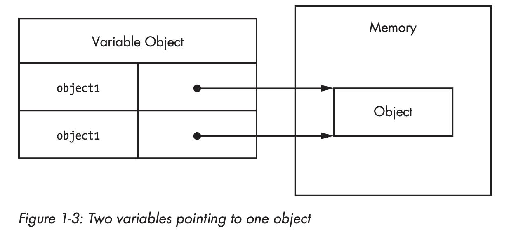

## Definition

JavaScript is high-level, often just-in-time compiled, and multi-paradigm programming language. It has curly-bracket syntax, dynamic typing, prototype-based object-orientation, and first-class functions.

As a multi-paradigm language, JavaScript supports event-driven, functional, and imperative programming styles. It has application programming interfaces (APIs) for working with text, dates, regular expressions, standard data structures, and the Document Object Model (DOM).

JavaScript is a client-side scripting language, which means the source code is processed by the client's web browser rather than on the web server.

## Data Types
There are two kinds of types in Javascript:  primitive and reference.
**Primitive types are stored as simple data types**. **Reference types are stored as objects, which are really just references
to locations in memory**.

### Primitive types
Primitive types represent simple pieces of data that are stored as is, such as (e.g. boolean true, number 42).
There are 6 primitive types in JavaScript: 

* Boolean
* Number
* String 
* Symbol 
* Null 
* Undefined

A variable holding a primitive directly **contains** the primitive value (rather than a pointer to an object).
When you assign a primitive value to a variable, the value is
**copied** into that variable. This means that if you set one variable equal
to another, each variable gets its **own copy** of the data. For example:
```javascript
var color1 = "red";
var color2 = color1;
```
Here, even though color1 and color2 contain the same value, they are completely **separate from each other**,
and you can change the value in color1 without affecting color2 and vice versa.
That’s because there are **two different storage locations**, one for each variable:



Because each variable containing a primitive value uses its own
storage space, changes to one variable **are not reflected on the other**. 
You can think of the variables as **having no relationship to each other**.
For example:
```javascript
var color1 = "red";
var color2 = color1;

console.log(color1); // "red"
console.log(color2); // "red"

color1 = "blue";

console.log(color1); // "blue"
console.log(color2); // "red"
```
In this code, color1 is changed to "blue" and color2 retains its original
value of "red".

*Conclusion*: If the value is a primitive type, when you access the variable, you manipulate the **actual value** stored in that variable. 
In other words, the variable that stores a primitive value is **accessed by value**.

### Reference types
Reference types do not store the object directly into the variable to
which it is assigned, instead, **it holds a pointer (or reference) to
the location in memory where the object exists.**
This is the primary difference between objects and primitive values, as the primitive is stored directly in the variable.
There are 3 main reference types in JavaScript:

* Array
* Object
* Function

When you assign an object to a variable, you’re actually assigning a
**pointer (reference)**. That means **if you assign one variable to another, each variable
gets a copy of the pointer, and both still reference the same object in
memory**. For example:
```javascript
var object1 = new Object();
var object2 = object1;
```
This code first creates an object and stores a **reference** in
object1. Next, object2 is assigned the value of object1. There is still only
the **one instance** of the object that was created on the first line, but both
variables now point to **that object**, as illustrated in Figure 1-3.


*Conclusion* If the value is a reference type, when you manipulate an object, you work on the **reference** of that object, rather than the actual object. 
It means a variable that stores an object is **accessed by reference**.


