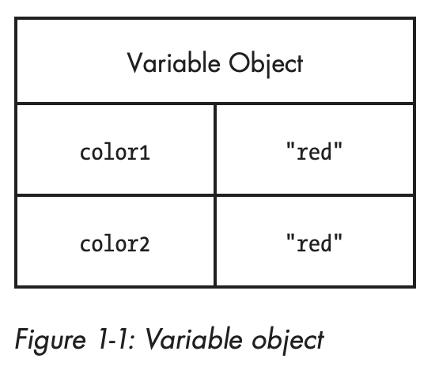

## Definition

JavaScript is high-level, often just-in-time compiled, and multi-paradigm programming language. It has curly-bracket syntax, dynamic typing, prototype-based object-orientation, and first-class functions.

As a multi-paradigm language, JavaScript supports event-driven, functional, and imperative programming styles. It has application programming interfaces (APIs) for working with text, dates, regular expressions, standard data structures, and the Document Object Model (DOM).

JavaScript is a client-side scripting language, which means the source code is processed by the client's web browser rather than on the web server.

## Data Types
There are two kinds of types in Javascript:  primitive and reference.
**Primitive types are stored as simple data types**. **Reference types are stored as objects, which are really just references
to locations in memory**.

### Primitive types
Primitive types represent simple pieces of data that are stored as is, such as (e.g. boolean true, number 42).
There are 6 primitive types in JavaScript: 

* Boolean
* Number
* String 
* Symbol 
* Null 
* Undefined

A variable holding a primitive directly **contains** the primitive value (rather than a pointer to an object).
When you assign a primitive value to a variable, the value is
**copied** into that variable. This means that if you set one variable equal
to another, each variable gets its **own copy** of the data. For example:
```javascript
var color1 = "red";
var color2 = color1;
```
Here, even though color1 and color2 contain the same value, they are completely **separate from each other**,
and you can change the value in color1 without affecting color2 and vice versa.
That’s because there are **two different storage locations**, one for each variable:



Because each variable containing a primitive value uses its own
storage space, changes to one variable **are not reflected on the other**. 
You can think of the variables as **having no relationship to each other**.
For example:
```javascript
var color1 = "red";
var color2 = color1;

console.log(color1); // "red"
console.log(color2); // "red"

color1 = "blue";

console.log(color1); // "blue"
console.log(color2); // "red"
```
In this code, color1 is changed to "blue" and color2 retains its original
value of "red".

*Conclusion*: If the value is a primitive type, when you access the variable, you manipulate the **actual value** stored in that variable. 
In other words, the variable that stores a primitive value is **accessed by value**.

### Reference types
Reference types do not store the object directly into the variable to
which it is assigned, instead, **it holds a pointer (or reference) to
the location in memory where the object exists.**
This is the primary difference between objects and primitive values, as the primitive is stored directly in the variable.
There are 3 main reference types in JavaScript:

* Array
* Object
* Function

When you assign an object to a variable, you’re actually assigning a
**pointer (reference)**. That means **if you assign one variable to another, each variable
gets a copy of the pointer, and both still reference the same object in
memory**. For example:
```javascript
var object1 = new Object();
var object2 = object1;
```
This code first creates an object and stores a **reference** in
object1. Next, object2 is assigned the value of object1. There is still only
the **one instance** of the object that was created on the first line, but both
variables now point to **that object**, as illustrated in Figure 1-3.


*Conclusion* If the value is a reference type, when you manipulate an object, you work on the **reference** of that object, rather than the actual object. 
It means a variable that stores an object is **accessed by reference**.


## Hoisting
Hoisting is a JavaScript mechanism where variables and function declarations are moved to the top of their scope before code execution. In other words **a variable can be used before it has been declared**. For example:
```javascript
x = 5; // Assign 5 to x

console.log(x); 5 // Used before declaration 

var x; // Declare x
```
:::important
JavaScript only hoists declarations, not initializations (assignments).      
:::
For example:                                                                       
```javascript
console.log(x); undefined // Used before declaration and before assigning a value

var x = 5;  // Declare and assign 5 to x
```
This is because only the declaration (var x), not the initialization (=5) is hoisted to the top.
Because of hoisting, x has been declared before it is used, but because **initializations are not hoisted**, the value of x is undefined.

### The let and const Keywords
Variables **defined with let and const** are hoisted to the top of the block, but not **initialized**.
Meaning: The block of code is aware of the variable, but it cannot be used until it has been declared.
In other words, with **let and const, you cannot use a variable before it is declared**.

Using **let** will result in a ReferenceError:
```javascript
x = 5; // Assign 5 to x

let x // Declare x;
```
Using a **const** variable before it is declared, is a syntax error, so the code will simply not run:
```javascript
x = 5; // Assign 5 to x

const x // Declare x;
```
## Closures
JavaScript variables can belong to the **local** or **global** scope.
Global variables can be made **local** (private) with **closures**.
For example:
```javascript
var add = (function () {
    var counter = 0;
    return function () {
        counter += 1;
        return counter
    }
})();
```
#### Example Explained
The variable **add** is assigned to the return value of a self-invoking function.
The self-invoking function only runs once. It sets the counter to zero (0), and returns a function expression.
The most important part is that **inner function** can access to the **outer function's** (its parent scope) "counter" variable.
This is called a JavaScript **closure**. It makes it possible for a function to have **local** (private) variables.
The "counter" variable is protected by the scope of the anonymous function, and can only be changed using the add function.

*Conclusion* A closure is a feature in JavaScript where an inner function has access to the outer (enclosing) function’s variables — a scope chain.
The closure has three scope chains:

* It has access to its own scope — variables defined between its curly brackets.
* It has access to the outer function’s variables.
* It has access to the global variables.


